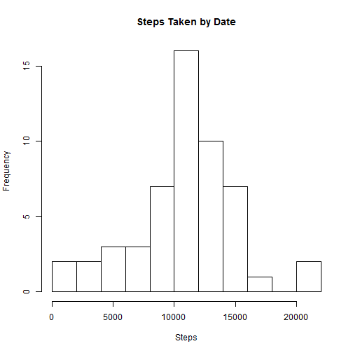
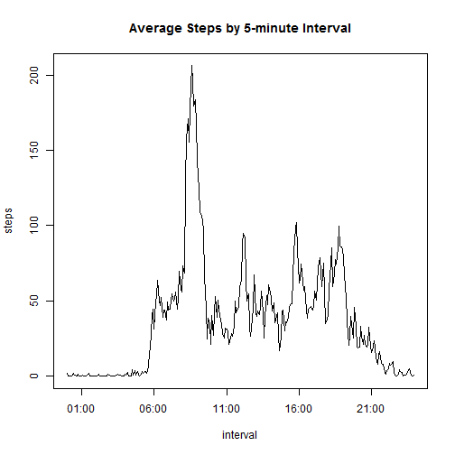
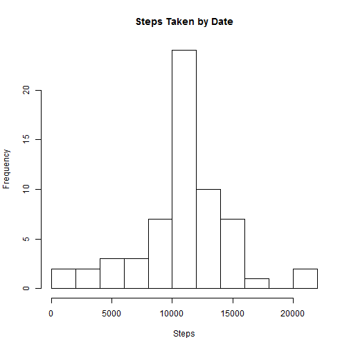
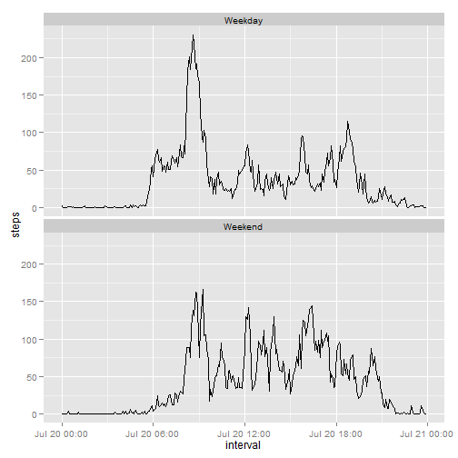

# Reproducible Research: Peer Assessment 1

## A note about Time data types

Because of how `R` deals with time types, even though all times included in the raw data set appear to be the user's local time -- in our processing we're treating all times as UTC to avoid implicit conversions.  To reiterate, we have not converted any times to UTC in our processing -- this is meerly a tag to prevent 'R' from doing implicit conversions that would alter our analysis.

## Loading and preprocessing the data
* Step 1: Read the data from the .zip file into our environment, then change the "interval" column into a time type.

```r
pa1.data <- read.csv(unzip("activity.zip"), header=TRUE,
                     colClasses = c("integer","Date","integer"));
pa1.strToTime <- function(str)
  {
    tStr <- sprintf("%04d", str);
    as.POSIXct(tStr, format= "%H%M", tz="UTC")
  }

pa1.data["interval"] <- lapply(pa1.data["interval"], pa1.strToTime);
```

## What is mean total number of steps taken per day?

* Step 1 : Create a function to Generate Histogram of number of steps taken by Date, then call it

```r
generateStepHist <- function(x)
  {
    hist(sapply(split(x$steps, x$date), sum), breaks=9,
         xlab="Steps", main="Steps Taken by Date");
  };
generateStepHist(pa1.data)
```

 

* Step 2: Generate a function which generates a data frame with mean and median by date, then use kable to format it as a table


```r
generateStepMeanMedianByDateTable <- function(table)
  {
    aggregation <- aggregate(steps ~ date, data=table, FUN=sum);
    kable(data.frame(Mean=mean(aggregation$steps), Median=median(aggregation$steps)))
  }

generateStepMeanMedianByDateTable(pa1.data)
```


|  Mean| Median|
|-----:|------:|
| 10766|  10765|

## What is the average daily activity pattern?
* First, we're going to aggregate the data by interval

```r
pa1.stepsByInterval <- aggregate(steps~interval, pa1.data, mean);
```
* Then, plot it.

```r
plot(pa1.stepsByInterval, main="Average Steps by 5-minute Interval", type="l")
```

 
* Discovering the maximum 5-minute inteval is trivial, just call the `max(...)` function

```r
pa1.Interval <- pa1.stepsByInterval$interval[
  pa1.stepsByInterval$steps == max(pa1.stepsByInterval$steps)];
strftime(pa1.Interval, format="%H:%M:%S", tz="UTC");
```

```
## [1] "08:35:00"
```

## Imputing missing values

* First, we need to calculate the total number of rows with NAs.  We will be using mapply
over each row to discover if any element is NA and then summing the resulting matrix.  We don't want to is.na over every element since a row could have multiple is.na values.


```r
sum(mapply(function(x,y,z) { is.na(x) || is.na(y) || is.na(z) }, 
           pa1.data$steps, pa1.data$date, pa1.data$interval))
```

```
## [1] 2304
```

To fill in the missing step values, we're going to use the mean value of that interval for the entire data set.  Specifically, we're going to extract every row that has a NA step count, merge that datatable with a datatable with the mean by interval step counts, then concat the result with the original table minus rows with NA values.

This apporoach is flawed for a great variety of reasons, one of which we're going to see very shortly (i.e. the difference between Weekday and Weekend walking patterns), but it's the simplest method we have avaliable and is fine to use as a baseline to improve upon and measure against.

We are cheating a little here by assuming that only step values have na's when before we assumed any value could -- but for our current data set this assumption holds.


```r
pa1.MeanStepByInterval <- aggregate(steps~interval, pa1.data, function(x) mean(x,na.rm=TRUE));
pa1.MissingSteps <- pa1.data[which(is.na(pa1.data$steps)), ];
pa1.MissingSteps <- merge(pa1.MeanStepByInterval, pa1.MissingSteps[, 2:3]);
pa1.DataFilled <- rbind(pa1.data[which(!is.na(pa1.data$steps)), ], pa1.MissingSteps);
```

* Now we redo the analysis from the first section of this study.  Because we did not stop to consider the distribution of NA values, we cannot form a hypothsis as to what we would expect the change to be.

```r
generateStepHist(pa1.DataFilled)
```

 

```r
generateStepMeanMedianByDateTable(pa1.DataFilled)
```


|  Mean| Median|
|-----:|------:|
| 10766|  10766|
The mean is the same, the median is now equal to the mean, when previously it was 1 step off.  The fact the median is now equal to the mean is interesting but not significant since it only represents a very small step and we never studied the distribution of NA values.

## Are there differences in activity patterns between weekdays and weekends?

* First, we are going to modify the `pa1.DataFilled` variable to include a column signifying if the date is a weekday or weekend, using the `weekdays(...)` function.


```r
pa1.DataFilled["IsWeekday"] <- !(weekdays(pa1.DataFilled$date) %in% c("Saturday","Sunday"));
pa1.WeekdaySteps <- aggregate(steps~interval, 
                              pa1.DataFilled[which(pa1.DataFilled$IsWeekday), ], mean);
pa1.WeekendSteps <- aggregate(steps~interval,
                              pa1.DataFilled[which(!(pa1.DataFilled$IsWeekday)), ], mean);

pa1.WeekdaySteps["Category"] <- rep("Weekday", each=nrow(pa1.WeekdaySteps));
pa1.WeekendSteps["Category"] <- rep("Weekend", each=nrow(pa1.WeekendSteps));
pa1.BoxPlotData <- rbind(pa1.WeekdaySteps, pa1.WeekendSteps);
```

* Now we have all the data we need to generate the weekday vs. weekend plot

(Note to grader: I spent quite a bit of time trying to figure out how to remove the Date from the plot.  In the end, I just spent too much time on it and am submitting it with the Date included -- which should be ignored.  I am still going to investigate how to do this, but will not have an answer in time for this assignment.)


```r
library(ggplot2)
ggplot(pa1.BoxPlotData, aes(x=interval, y=steps)) + geom_line() + facet_wrap(~ Category, ncol=1)
```

 


